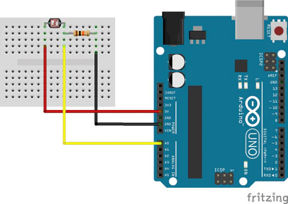
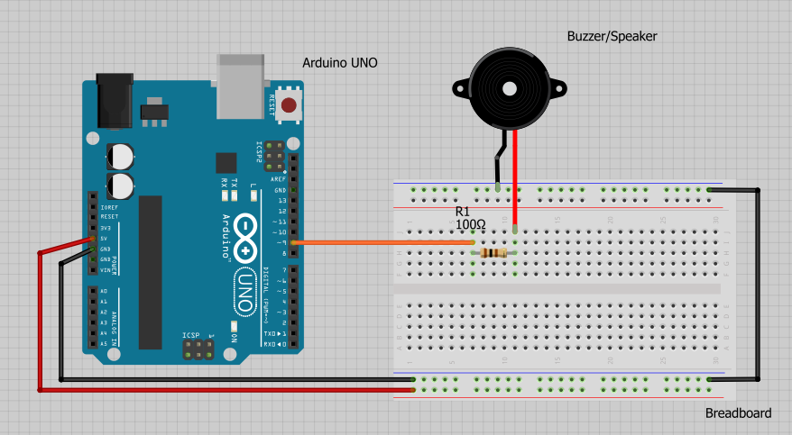
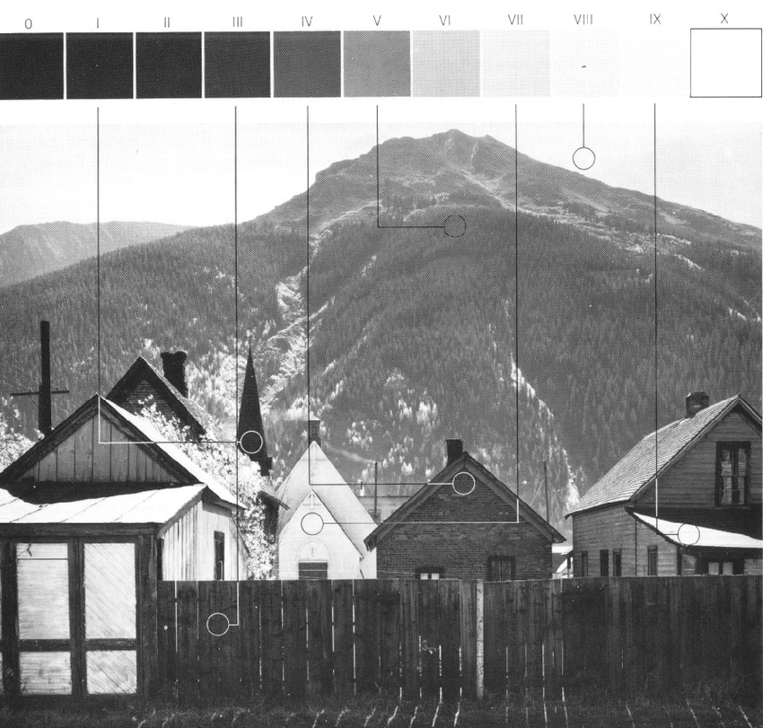
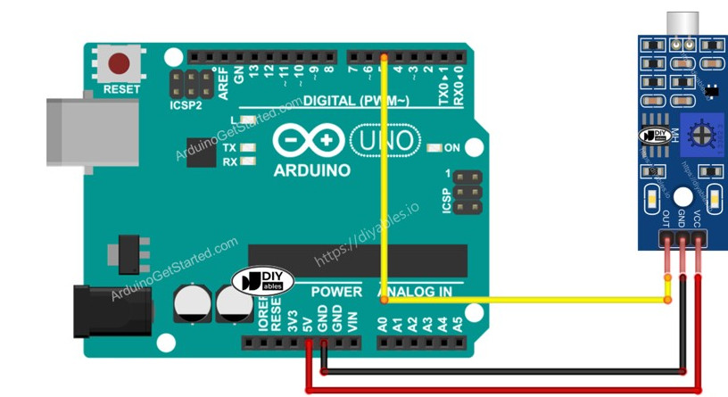
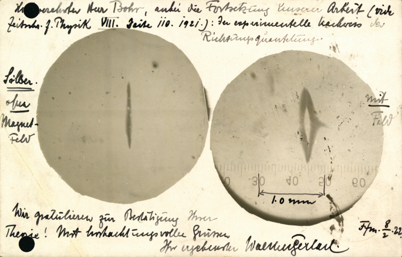
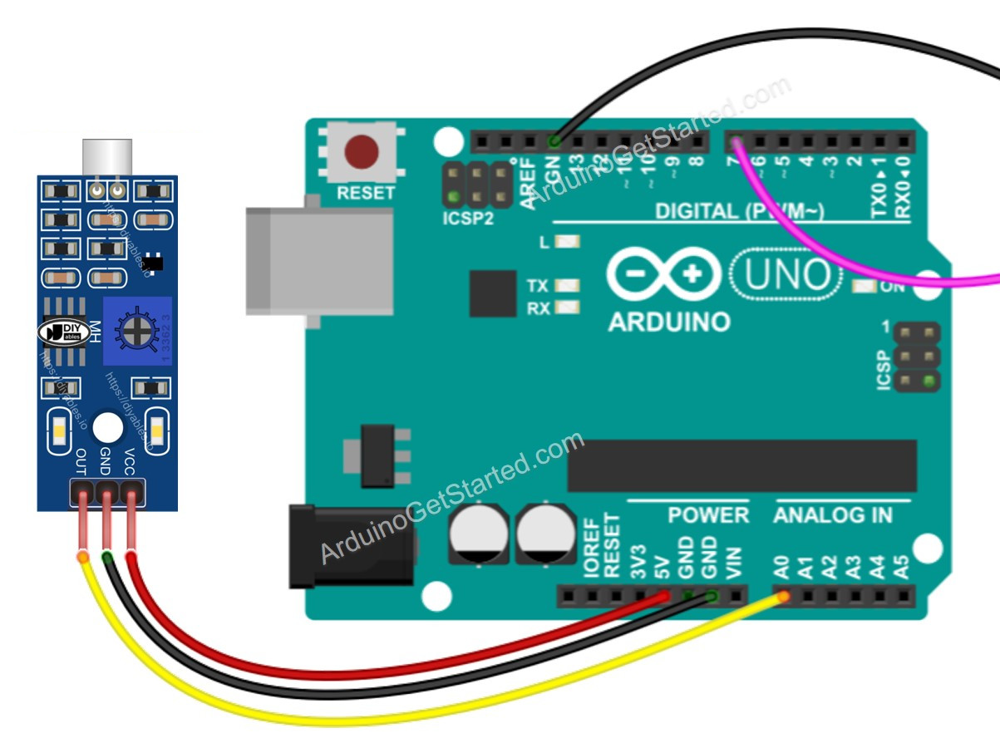
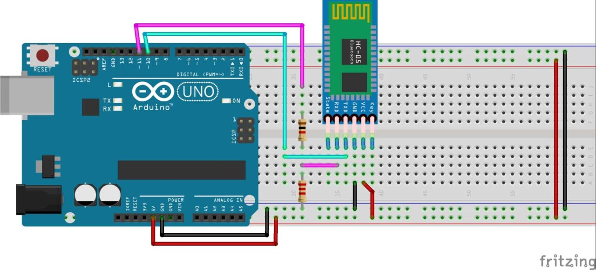
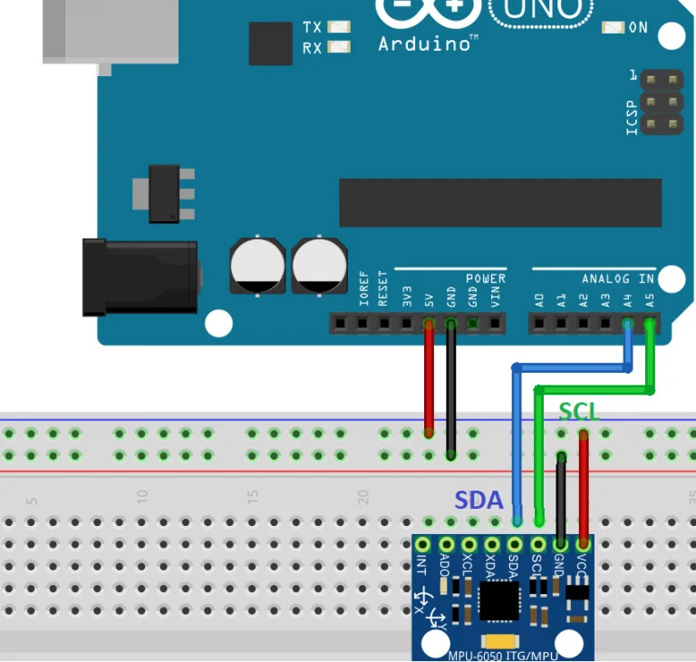
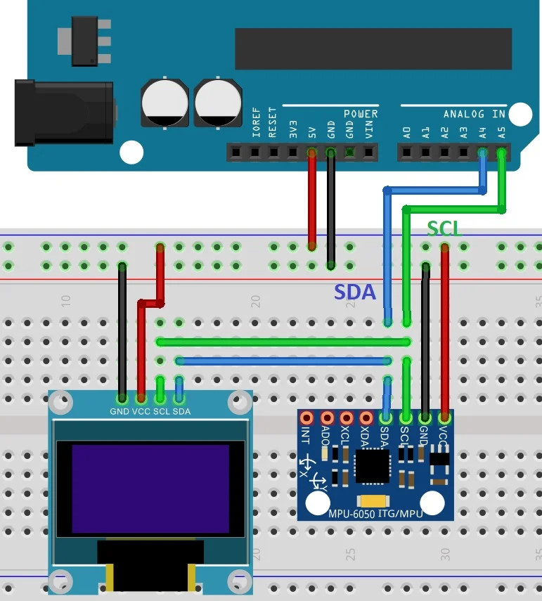

# Intra-acciones. Entrelazamientos y reconfiguraciones


<br>
<br>

## Instalación de Arduino
[Descarga Arduino IDE](https://www.arduino.cc/en/software)


<br>
<br>

## Sensor de luz, LDR

<br>



```java
void setup() {
 pinMode(A0, INPUT);
 Serial.begin(9600);
}

void loop() {
 int valor = analogRead(A0);
 Serial.println(valor);
 delay(10);
}
``` 

<br>

> **_Serial Monitor:_**  La herramienta con la que recibir los datos que Arduino envía.

<br>
<br>

## Añadimos un altavoz

<br>




```java
void setup() {
 pinMode(A0, INPUT);
 pinMode(3, OUTPUT);
 Serial.begin(9600);
}

void loop() {
 int valor = analogRead(A0);
 Serial.println(valor);
 delay(10);

 if (valor < 400) tone(3, 440); // intra-accion: definimos un umbral
 else noTone(3);
}
```
<br>

O que cuando salgas de una zona con un rango de luz determinado, el altavoz pite:

<br>

```java
void setup() {
 pinMode(A0, INPUT);
 pinMode(3, OUTPUT);
 Serial.begin(9600);
}

void loop() {
 int valor = analogRead(A0);
 Serial.println(valor);

 if (valor > 300 && valor < 600) { // intra-accion: sistema de Zonas, Anselm Adams
   noTone(3);
 }
 else tone(3, 440);
}
```




<br>

versión Theremin:

<br>

```java
void setup() {
 pinMode(A0, INPUT);
 pinMode(3, OUTPUT);
 Serial.begin(9600);
}

void loop() {
 int valor = analogRead(A0);
 Serial.println(valor);

 if (valor > 300 && valor < 400) {
   tone(3, map(valor, 300, 400, 440, 880));
 }
 else noTone(3);
}
 
```

<br>
<br>

## ¿Qué pasa si pegamos el sensor a la pantalla?

<br>

Imágenes como sensores. *Environments of images*. Monitorización y circulación.

<br>

#### 1. Dejar que el sensor acompañe un rato a la pantalla

<br>

#### 2. Con un vídeo 

P. ej. [este fragmento de Michael Snow, *La Region Centrale*](https://www.youtube.com/embed/uYr_SvIKKuI)
<br>
<iframe width="1000" height="750" src="https://www.youtube.com/embed/uYr_SvIKKuI" title="Michael Snow - La Région Centrale (1971)" frameborder="0" allow="accelerometer; autoplay; clipboard-write; encrypted-media; gyroscope; picture-in-picture; web-share" referrerpolicy="strict-origin-when-cross-origin" allowfullscreen></iframe><br>

<br>

#### 3. Con imágenes satélite

Por ejemplo: [aquí](https://www.google.com/maps/@30.6689607,7.1025301,3280m/data=!3m1!1e3!5m1!1e4?entry=ttu&g_ep=EgoyMDI1MDQwNi4wIKXMDSoJLDEwMjExNDUzSAFQAw%3D%3D)<br>
<iframe src="https://www.google.com/maps/embed?pb=!1m10!1m8!1m3!1d17266.273229289323!2d7.102573015344233!3d30.667594919693702!3m2!1i1024!2i768!4f13.1!5e1!3m2!1ses!2ses!4v1744238745594!5m2!1ses!2ses" width="600" height="450" style="border:0;" allowfullscreen="" loading="lazy" referrerpolicy="no-referrer-when-downgrade"></iframe>

<br>
<br>

## Sound sensor

<br>



```java
// pin 4 sensor sonido
// pin 3 altavoz
// pin 13 led

void setup() {
 Serial.begin(9600);
 pinMode(3, OUTPUT);
 pinMode(4, INPUT);
 pinMode(13, OUTPUT);
}

void loop() {
 int valorSensor = digitalRead(4);
 if (valorSensor == HIGH) {
   digitalWrite(13, HIGH);
   tone(3, 440);
 }
 else {
   digitalWrite(13, LOW);
   noTone(3);
 }
 Serial.println(valorSensor);
 delay(10);
}
```

<br>

> **_APENAS ESCUCHA_**  Sirve para detectar sonidos por encima de un umbral... Pero también la respiración! (--> Stern-Gerlach)

<br>




<br>
<br>


## Sound Sensor como analógico para suavizar la señal

<br>



```java
// pin 4 sensor sonido
// pin 3 altavoz
// pin 13 led
int valor = 0;

void setup() {
 Serial.begin(9600);
 pinMode(3, OUTPUT);
 pinMode(A1, INPUT);
 pinMode(13, OUTPUT);
}

void loop() {
 int valorSensor = analogRead(A1);
 valor = valor + 0.1 * ( valorSensor - valor );
  if (valor > 500) {
   digitalWrite(13, HIGH);
   tone(3,440);
 } else {
   digitalWrite(13, LOW);
   noTone(3);
 }
 Serial.println(valor);
}
```

<br>
<br>

## Bluetooth

<br>



```java
// pin A0 sensor sonido
// pin 3 altavoz
// pin 13 led
// pines 10 11 RX,TX
#include <SoftwareSerial.h>
SoftwareSerial BTserial(10, 11);  // RX | TX
const long baudRate = 38400;

int valor;
long last = 0;

void setup() {
 Serial.begin(9600);

 BTserial.begin(baudRate);
 Serial.print("BTserial started at ");
 Serial.println(baudRate);
 Serial.println(" ");

 pinMode(A0, INPUT);
 pinMode(3, OUTPUT);
 pinMode(13, OUTPUT);
}

void loop() {
 int valorSensor = analogRead(A1);
 valor = valor + 0.1 * (valorSensor - valor);

 int enviado = 0;
 if (valor > 500) enviado = 1;
 else enviado = 0;

 if (millis() - last > 100) {
   BTserial.println(enviado);
   last = millis();
 }

 // Recibe datos de bluetooth
 String inString = "";
 while (BTserial.available()) {
   inString = BTserial.readStringUntil('\n');
 }
 if (inString != "") {
   Serial.println(inString);
   int recibido = inString.toInt();
   if (recibido == 1) tone(3, 440);
   else noTone(3);
 }
}
```

<br>

Invertimos lógica:

<br>

```java

 int enviado = 0;
 if (valor < 500) enviado = 1;
 else enviado = 0;

```

<br>
<br>

## Display OLED

<br>


```java
// pin A0 sensor sonido
// pin 3 altavoz
// pin 13 led
// pines 10 11 RX,TX
#include <SoftwareSerial.h>
SoftwareSerial BTserial(10, 11);  // RX | TX
const long baudRate = 38400;

int valor;
long last = 0;

//GND - GND
//VCC - VCC
//SDA - Pin A4
//SCL - Pin A5
#include <Adafruit_GFX.h>
#include <Adafruit_SSD1306.h>
#include <math.h>

// Definir constantes
#define ANCHO_PANTALLA 128  // ancho pantalla OLED
#define ALTO_PANTALLA 64    // alto pantalla OLED

// Objeto de la clase Adafruit_SSD1306
Adafruit_SSD1306 display(ANCHO_PANTALLA, ALTO_PANTALLA, &Wire, -1);

void setup() {
 Serial.begin(9600);
 BTserial.begin(baudRate);
 Serial.print("BTserial started at ");
 Serial.println(baudRate);
 Serial.println(" ");

 pinMode(A0, INPUT);
 pinMode(3, OUTPUT);
 pinMode(13, OUTPUT);

 // Iniciar pantalla OLED en la dirección 0x3C
 if (!display.begin(SSD1306_SWITCHCAPVCC, 0x3C)) {
   Serial.println("No se encuentra la pantalla OLED");
 }
}

void loop() {
 int valorSensor = analogRead(A1);
 valor = valor + 0.1 * (valorSensor - valor);

 // DISPLAY
 display.clearDisplay();  // Limpiar buffer

 display.setTextSize(1);               // Tamaño del texto
 display.setTextColor(SSD1306_WHITE);  // Color del texto
 display.setCursor(0, 0);              // Posición del texto
 display.println(valorSensor);         // Escribir texto

 display.setTextSize(2);               // Tamaño del texto
 display.setTextColor(SSD1306_WHITE);  // Color del texto
 display.setCursor(10, 20);            // Posición del texto
 display.println(valor);               // Escribir texto

 // Enviar a pantalla
 display.display();
}

```

<br>
<br>

## Giroscopio

<br>



```java
#include <math.h>

// Display
//GND - GND
//VCC - VCC
//SDA - Pin A4
//SCL - Pin A5
#include <Adafruit_GFX.h>
#include <Adafruit_SSD1306.h>
#define ANCHO_PANTALLA 128  // ancho pantalla OLED
#define ALTO_PANTALLA 64    // alto pantalla OLED
Adafruit_SSD1306 display(ANCHO_PANTALLA, ALTO_PANTALLA, &Wire, -1);

// Bluetooth
#include <SoftwareSerial.h>
SoftwareSerial BTserial(10, 11);  // RX | TX
const long baudRate = 38400;
long last = 0;

// Giroscopio
#include <SPI.h>
#include <Wire.h>
#include "I2Cdev.h"
#include "MPU6050.h"
const int mpuAddress = 0x68;  // Puede ser 0x68 o 0x69
MPU6050 mpu(mpuAddress);
int ax, ay, az;
int gx, gy, gz;


void setup() {
 Serial.begin(9600);
  // DISPLAY
 Serial.println("Iniciando pantalla OLED");
 if (!display.begin(SSD1306_SWITCHCAPVCC, 0x3C)) {
   Serial.println("No se encuentra la pantalla OLED");
 }

 // MICROFONO, ALTAVOZ, LED
 pinMode(A0, INPUT);
 pinMode(3, OUTPUT);
 pinMode(13, OUTPUT);
  
 // GIROSCOPIO
 Wire.begin();
 mpu.initialize();
 Serial.println(mpu.testConnection() ? F("IMU iniciado correctamente") : F("Error al iniciar IMU"));

 // BLUETOOTH
 BTserial.begin(baudRate);
 Serial.print("BTserial started at ");
 Serial.println(baudRate);
 Serial.println(" ");
}

void loop() {
 // Leer las aceleraciones
 mpu.getAcceleration(&ax, &ay, &az);

 //Calcular los angulos de inclinacion
 float accel_ang_x = atan(ax / sqrt(pow(ay, 2) + pow(az, 2))) * (180.0 / 3.14);
 float accel_ang_y = atan(ay / sqrt(pow(ax, 2) + pow(az, 2))) * (180.0 / 3.14);

 // DISPLAY
 display.clearDisplay();  // Limpiar buffer

 display.setTextSize(2);               // Tamaño del texto
 display.setTextColor(SSD1306_WHITE);  // Color del texto

 display.setCursor(0, 0);              // Posición del texto
 display.println(accel_ang_y);  // Escribir texto

 display.setCursor(50, 20);         // Posición del texto
 display.println(accel_ang_x);  // Escribir texto

 // Enviar a pantalla
 display.display();

 delay(10);
}
```

<br>
<br>

## Giroscopio y bluetooth

<br>



```java
#include <Adafruit_GFX.h>
#include <Adafruit_SSD1306.h>

#include <math.h>

// Definir constantes
#define ANCHO_PANTALLA 128  // ancho pantalla OLED
#define ALTO_PANTALLA 64    // alto pantalla OLED

// Objeto de la clase Adafruit_SSD1306
//GND - GND
//VCC - VCC
//SDA - Pin A4
//SCL - Pin A5
Adafruit_SSD1306 display(ANCHO_PANTALLA, ALTO_PANTALLA, &Wire, -1);
String stringDisplayed = "";

#include <SoftwareSerial.h>
SoftwareSerial BTserial(10, 11);  // RX | TX
const long baudRate = 38400;
long last = 0;

#include <SPI.h>
#include <Wire.h>
#include "I2Cdev.h"
#include "MPU6050.h"

const int mpuAddress = 0x68;  // Puede ser 0x68 o 0x69
MPU6050 mpu(mpuAddress);
int ax, ay, az;
int gx, gy, gz;

void setup() {
 Serial.begin(9600);
 Serial.println("Iniciando pantalla OLED");

 // Iniciar pantalla OLED en la dirección 0x3C
 if (!display.begin(SSD1306_SWITCHCAPVCC, 0x3C)) {
   Serial.println("No se encuentra la pantalla OLED");
 }

 pinMode(A0, INPUT);
 pinMode(3, OUTPUT);
 pinMode(13, OUTPUT);
  
 // GIROSCOPIO
 Wire.begin();
 mpu.initialize();
 Serial.println(mpu.testConnection() ? F("IMU iniciado correctamente") : F("Error al iniciar IMU"));

 BTserial.begin(baudRate);
 Serial.print("BTserial started at ");
 Serial.println(baudRate);
 Serial.println(" ");
}

void loop() {
 // Leer las aceleraciones
 mpu.getAcceleration(&ax, &ay, &az);

 //Calcular los angulos de inclinacion
 float accel_ang_x = atan(ax / sqrt(pow(ay, 2) + pow(az, 2))) * (180.0 / 3.14);
 float accel_ang_y = atan(ay / sqrt(pow(ax, 2) + pow(az, 2))) * (180.0 / 3.14);

 if (millis() - last > 100) {
   last = millis();
   BTserial.println(round(accel_ang_x));
 } else {

   String inString = "";
   while (BTserial.available()) {
     inString = BTserial.readStringUntil('\n');
   }
   if (inString != "") {
     stringDisplayed = inString;
   }
 }

 display.clearDisplay();  // Limpiar buffer

 display.setTextSize(2);               // Tamaño del texto
 display.setTextColor(SSD1306_WHITE);  // Color del texto

 display.setCursor(0, 0);              // Posición del texto
 display.println(round(accel_ang_x));  // Escribir texto

 display.setCursor(50, 20);         // Posición del texto
 display.println(stringDisplayed);  // Escribir texto

 // Enviar a pantalla
 display.display();

 if (abs(stringDisplayed.toFloat() - round(accel_ang_x)) > 10) tone(3, 440);
 else noTone(3);

 delay(10);
}
```
